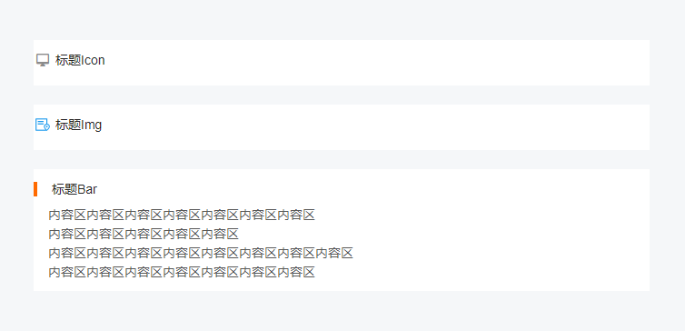

# Custom Icon Container Block

## Overview



## Props
```ts
@Prop({ default: '' }) private title!: string // 标题
@Prop({ default: 'bar' }) private type!: 'bar' | 'icon' | 'img' | 'slot' | 'none' // 显示 icon 的方式
@Prop({ default: '' }) private icon!: string // type=icon时，为icon的type  type=img时，为img的src
```

## 使用
```html
<CustomIconContainer type='icon' icon='md-desktop' title='标题Icon'>
  <p>内容区内容区内容区内容区内容区内容区内容区</p>
  <p>内容区内容区内容区内容区内容区</p>
  <p>内容区内容区内容区内容区内容区内容区内容区内容区</p>
  <p>内容区内容区内容区内容区内容区内容区内容区</p>
</CustomIconContainer>

<CustomIconContainer type='img' icon={ require('./img/icon.png') } title='标题Img'>
  <p>内容区内容区内容区内容区内容区内容区内容区</p>
  <p>内容区内容区内容区内容区内容区</p>
  <p>内容区内容区内容区内容区内容区内容区内容区内容区</p>
  <p>内容区内容区内容区内容区内容区内容区内容区</p>
</CustomIconContainer>

<CustomIconContainer type='bar' title='标题Bar'>
  <p>内容区内容区内容区内容区内容区内容区内容区</p>
  <p>内容区内容区内容区内容区内容区</p>
  <p>内容区内容区内容区内容区内容区内容区内容区内容区</p>
  <p>内容区内容区内容区内容区内容区内容区内容区</p>
</CustomIconContainer>
```
